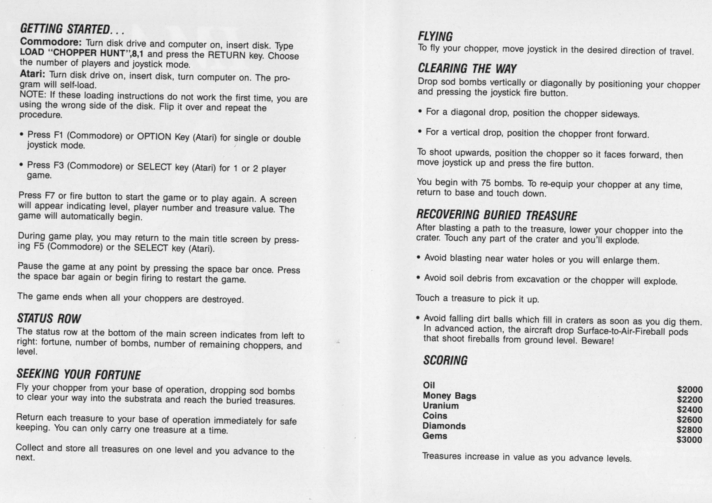
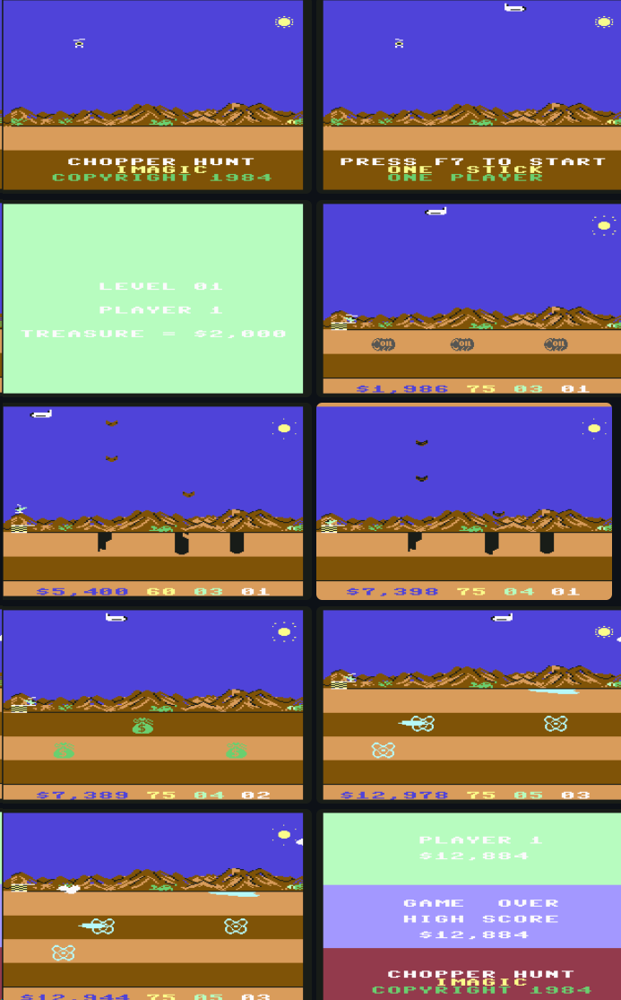
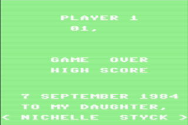

# ChopperHuntC64

The provided assembly code is for the Commodore 64 game 'Chopper Hunt'. The code is written in 64tass assembler syntax. This document provides a detailed analysis of the code for educational purposes, explaining the game's logic, hardware interactions, and overall structure, with a focus on Commodore 64-specific programming techniques.

Assembled with **64tass v1.60.3243** (r3243, 2025-05-10) — <https://sourceforge.net/projects/tass64/> (source: <https://github.com/soci64/tass64>).

## Play it now — no programming needed

You don't have to assemble or build anything. A ready-to-run game file is
already included in this repository:

- **`CHOPHUNT.prg`** — the finished game, in Commodore 64 program-file
  format (like an `.exe` is for Windows).

### 1. Get a free Commodore 64 emulator

The game runs inside a free emulator called **VICE**:

- Official downloads for Windows, macOS, and Linux:
  <https://vice-emu.sourceforge.io/>

### 2. Download the game

Grab the pre-built file straight from this repository:

- **[Download CHOPHUNT.prg](https://github.com/styck/ChopperHuntC64/raw/main/CHOPHUNT.prg)**

### 3. Run it

Open VICE, then **drag and drop `CHOPHUNT.prg` onto the emulator window**
(or use **File → Autostart image…** and pick the file).

The game loads and starts on its own. That's it.

### Controls

| When | Action |
| --- | --- |
| Title screen | **F3** — switch 1 / 2 players · **F1** — switch 1 / 2 joysticks |
| Title screen | **F7** or **fire button** — start the game |
| Playing | **Joystick** — fly the helicopter |
| Playing | **Fire button** — drop a bomb |
| Playing | **Space** — pause |
| Playing | **F7** — restart · **F5** — back to the title screen |

> VICE emulates the joystick with the keyboard by default. Use
> **Settings → Joystick** in VICE to see the current keys or to connect a
> real controller.

---

*(Everything below is for developers and restorers — you can stop reading
here if you only wanted to play the game.)*

## Disclaimer

> This source code is published strictly for historical preservation,
> education, and research purposes. If you are the rightful copyright holder
> of this code and object to its archival, please contact me and it will be
> removed immediately.

## Game Overview

Chopper Hunt is an action game where the player controls a helicopter. Each level the player must collect the three treasure bags ("bucks") and drop them off on the landing pad to advance. Dirt and rock fall from above, and the chopper can dig through the terrain with bombs and a gun, but hitting the mountains, water, or falling debris crashes it. Levels get harder as the game progresses.

## Historical Note

*Chopper Hunt* is a 1984 Commodore 64 side-view shoot-'em-up published by
Imagic. It is a rework of the 1982 Atari 8-bit game *Buried Buck$* (Buried
Bucks), which introduced the core loop: bomb the ground to dig holes, uncover
hidden treasure, and carry it back to base before falling dirt traps you.

The C64 version upgraded the presentation — rolling mountains, clouds, and a
sun — replaced the enemy bomber with a fighter jet, and added per-level
treasure variety (oil barrels on level 1, money bags on level 2, uranium on
later levels). The chopper carries only one treasure at a time and drops it
if destroyed before returning to base. Later levels have taller terrain,
less open sky, and faster hazards.

Released near the end of Imagic's life, the game is remembered as a polished,
colorful take on a simple but addictive dig-and-return mechanic. The original
source credits the game to "Applied Computer Technology"
(`BY APPLIED COMPUTER TECHNOLOGY`, 1984).

## Easter Egg — Dedication Screen

The game contains a hidden dedication to the developer's daughter, Nichelle.
On the 1-player game-over screen the normal "CHOPPER HUNT / IMAGIC /
COPYRIGHT 1984" credits are replaced with:

    7 SEPTEMBER 1984
    TO MY DAUGHTER,
  < NICHELLE  STYCK >

The text lives in `CHOPEQU.ASM` (`NAME`, `NAME2`, `NAME3`) and is printed by
`GAMEOVER.ASM` when `NAME_FLAG` is set.

**Trigger** (from `MAIN_LOOP` in `CHOPCOD1.ASM`): press **SPACE** while all
of the following are true:

1. **On the first level** (`BILEVL == 0`; the code comment reads
   "ON THE FIRST LEVEL?").
2. **Below ground level** — dug down into the dirt
   (`CHOP_Y - $2E >= INILVL`).
3. **Facing right** (`BODPH == 4`).

Pressing SPACE arms `NAME_FLAG` (and toggles pause, as usual). Then lose
your last life to see the dedication. It does not appear in 2-player games —
`GAMEOVER.ASM` only checks `NAME_FLAG` when `PLAYRS == 0`.

## Code Structure

The code is modular, with different functionalities separated into multiple `.ASM` files. The main file, `CHOPHUNT.ASM`, includes all other files to assemble the final program. The code is well-commented, which aids in understanding the logic.

### Key Files and Their Functions:

*   **`CHOPHUNT.ASM`**: The main file that includes all other assembly files.
*   **`CHOPCOD1.ASM` - `CHOPCOD5.ASM`**: These files contain the core game logic, including the main game loop, player controls, level progression, and collision detection.
*   **`CHOPEQU.ASM`**: This file defines constants and hardware register addresses, making the code more readable and maintainable.
*   **`IRQ.ASM`**: This file handles interrupt routines, which are crucial for real-time games on the C64. It manages tasks like updating sprite positions, reading joystick input, and playing sounds.
*   **`SOUND.ASM`**: This file contains the code for generating sound effects and music using the C64's SID chip.
*   **`SHAPES.ASM`**: This file defines the shapes for sprites and other graphical elements.
*   **`BOMB.ASM`**, **`EXPLODE.ASM`**, **`DIRTBOMB.ASM`**: These files handle the logic for bombs and explosions.
*   **`GUNCOD1.ASM` - `GUNCOD3.ASM`**, **`GUNCHECK.ASM`**, **`GUNCHANC.ASM`**: These files manage the gun and shooting mechanics.

## Hardware Interaction

The code directly interacts with the C64's hardware to generate graphics and sound. The following sections provide a detailed look at how the game uses the C64's custom chips.

### Graphics: The VIC-II Chip

The VIC-II (Video Interface Chip) is responsible for all graphics on the C64. It is located at memory addresses `$D000-$D3FF`. The game uses a combination of bitmap and character modes, as well as sprites, to create its visuals.

#### Screen Setup

The game sets up the screen in `CHOPCOD4.ASM`. The following code snippet from `SETUP_HIRES` shows how the game enables multicolor bitmap mode:

```assembly
SETUP_HIRES
    LDA PORTA2
    AND #$FC
    ORA #$02
    STA PORTA2
    LDA #$08
    STA VIC_MEMORY
    LDA VIC_CONTROL_1
    ORA #32
    STA VIC_CONTROL_1
    LDA VIC_CONTROL_2
    ORA #16
    STA VIC_CONTROL_2
```

*   `PORTA2` at `$DD00` is used to select the video bank.
*   `VIC_MEMORY` at `$D018` is configured to tell the VIC-II where to find screen and character memory.
*   `VIC_CONTROL_1` at `$D011` and `VIC_CONTROL_2` at `$D016` are used to control various screen modes. Here, the code sets bit 5 of `$D011` to enable bitmap mode and bit 4 of `$D016` to enable multicolor mode.

#### Sprites

Sprites are movable objects that are independent of the background. The game uses sprites for the helicopter, enemies, and other game elements. The `INIT_GAME` routine in `CHOPCOD4.ASM` sets up the sprites:

```assembly
INIT_GAME
    ...
    LDA #$12
    STA SPRITE_POINTER   ;POINT TO CHOPPER
    LDA #$16
    STA SPRITE_POINTER+1 ;POINT TO PLANE
    ...
    LDA #LT_GREEN
    STA SPRITE_COLOR
    ...
    LDA #$FF
    STA SPRITE_ENABLE
```

*   `SPRITE_POINTER` is an array in memory (starting at `$43F8` in this case) that stores pointers to the sprite data in `SHAPES.ASM`.
*   `SPRITE_COLOR` at `$D027` sets the color for each sprite.
*   `SPRITE_ENABLE` at `$D015` is a bitmask that turns individual sprites on or off.

#### Raster Interrupts

The game uses raster interrupts to change screen colors and perform other actions at specific scanlines. The `IRQ.ASM` file contains the interrupt service routine. The following code from `IRQ1` in `IRQ.ASM` shows how a raster interrupt is set up:

```assembly
IRQ1:
    LDA #BLACK
    STA BACKGROUND_COLOR0
    JSR SETUP_HIRES     ; put the VIC into multicolor bitmap mode
    ...
    LDA #$B0            ; MOD3: set up the next raster split
    LDX #<IRQ1_2
    LDY #>IRQ1_2
    STA RASTER
    STX IRQLO
    STY IRQHI
    LDA #$81
    STA VIC_IRQ
    ...
    RTI
```

*   `RASTER` at `$D012` is set to the scanline where the interrupt should occur.
*   `IRQLO` and `IRQHI` (at `$0314` and `$0315`) are set to the address of the next interrupt routine (`IRQ1_2`).
*   `VIC_IRQ` at `$D019` is used to acknowledge the interrupt.

### Sound: The SID Chip

The SID (Sound Interface Device) chip, located at `$D400-$D7FF`, is a powerful sound synthesizer. The game uses it to create sound effects and music.

#### Sound Initialization

The `INIT_SOUND` routine in `CHOPCOD4.ASM` initializes the SID chip:

```assembly
INIT_SOUND
    LDA #$00
    STA FREQ_1   ;LOW BYTE
    LDA #$05
    STA FREQ_1+1 ;HI BYTE ($500)
    LDA #$11
    STA ATTDEC_1
    LDA #$24
    STA SUSREL_1
    ...
    LDA #$0A
    STA MASTER_VOLUME
```

*   `FREQ_1` at `$D400` sets the frequency of voice 1.
*   `ATTDEC_1` at `$D405` sets the attack and decay rates for the envelope generator.
*   `SUSREL_1` at `$D406` sets the sustain and release rates.
*   `MASTER_VOLUME` at `$D418` controls the overall volume.

#### Generating Sound Effects

The `SOUND.ASM` file contains the code for generating sound effects. For example, the following code from `DO_SOUNDS` creates an explosion sound:

```assembly
DO_SOUNDS
    ...
    LDA EXPL_FREQ
    BEQ _11
    LDA #$02
    STA FREQ_2+1
    LDA EXPL_FREQ
    SEC
    SBC #$0F
    STA EXPL_FREQ
    STA FREQ_2
    LDA #$81
    STA $D40B
```

This code creates a descending frequency sweep on voice 2 to simulate an explosion sound.

### Input/Output: The CIA Chips

The two CIA (Complex Interface Adapter) chips, located at `$DC00-$DCFF` and `$DD00-$DDFF`, handle various I/O tasks, including reading the joysticks.

#### Reading the Joysticks

The `READ_STICKS` routine in `CHOPCOD4.ASM` reads the joystick ports:

```assembly
READ_STICKS
    LDA STICK_NUMBER
    BNE _1
    LDA PORTB1
    AND #$1F
    RTS
_1
    LDA PLAYER
    BNE _2
    LDA PORTB1
    AND #$1F
    RTS
_2
    LDA PORTA1
    AND #$1F
    RTS
```

*   `PORTA1` at `$DC00` and `PORTB1` at `$DC01` are the data registers for the two joystick ports. The code reads these registers and masks the lower 5 bits to get the joystick direction and fire button state.


The `PRINT_MACRO` and the `PRINT` routine work together as a system to display text on the screen. Here’s how they interact:

1. __The `PRINT_MACRO` (The Planner):__ When you use `PRINT_MACRO` in the code, you're using a convenient shortcut. You provide it with the essential information: an X/Y screen position, a color, and the text string you want to display. The macro's job is to prepare everything for the main `PRINT` routine. It does this by:

   - Loading the X and Y coordinates into the processor's X and Y registers.
   - Storing the specified color in a special memory location called `PRINT_COLOR` so the `PRINT` routine knows what color to use.
   - Placing the text you want to print directly into the code, right after calling the `PRINT` routine. It adds a special marker (`$FF`) at the end of the text to signal "this is the end of the message."

2. __The `JSR PRINT` Call (The Hand-off):__ The macro then calls the `PRINT` routine using a `JSR` (Jump to Subroutine) instruction. When this happens, the computer automatically saves the address of the *next* instruction onto a temporary storage area called the stack. In this case, the "next instruction" is actually the beginning of the text string that the macro placed in the code.

3. __The `PRINT` Routine (The Worker):__ This is where the actual drawing happens. The `PRINT` routine is clever; it knows that the address saved on the stack isn't a place to return to, but is actually a pointer to the text it needs to print.

   - __Finds the Text:__ It immediately retrieves this address from the stack.

   - __Calculates Screen Position:__ It takes the Y-coordinate and multiplies it by 40 (the width of the screen) and then adds the X-coordinate. This calculation gives it the exact starting memory address in the C64's screen RAM for where the text should appear.

   - __Enters a Loop:__ The routine then reads the text one character at a time using its text pointer.

     - For each character, it looks up the corresponding wide-font pattern (since each character is two-bytes wide).
     - It writes these two pattern-bytes to the calculated screen RAM address.
     - It then calculates the corresponding address in Color RAM and writes the stored `PRINT_COLOR` value there for both bytes, making the character appear in the correct color.
     - It advances its screen/color pointers by two and its text pointer by one, ready for the next character.

   - __Finishes the Job:__ This loop continues until it reads the `$FF` end-of-text marker. Once it sees this, it knows it's done printing. It then uses the text pointer (which is now pointing just past the `$FF` marker) to jump back to the main program flow, continuing execution from where the macro left off.

In short, the `PRINT_MACRO` acts as a user-friendly interface that sets up the parameters, while the `PRINT` routine is the low-level engine that performs the complex calculations and memory writes to render the text on the screen.


## Sprite Data Reference

Sprite graphics live in VIC bank 1 (`PORTA2` = `$02`, `$4000-$7FFF`). The
sprite data is at `$4400-$4B7F` — 30 blocks of 64 bytes each — selected by
the sprite pointers at `$43F8-$43FF`. A pointer value of `$10` addresses
`$4400`, `$16` addresses `$4580`, etc. (`address = $4000 + pointer * 64`).

### Block map

| Block | Sprite | Source | Notes |
|-------|--------|--------|-------|
| `$10-$14` | Chopper / helicopter (5 frames) | `CHOP_SHAPE` | multicolor |
| `$15-$16` | Plane (2 frames) | `PLN_SHAPE` | `$15` faces left, `$16` faces right |
| `$17-$1B` | Smart bomb (5 frames) | `GUN_SHAPE` | multicolor |
| `$1C-$21` | Sun (6 frames) | `SUN_TABLE` | hi-res |
| `$22` | unused | — | |
| `$23` | Buck / treasure | sprite 5 pointer | |
| `$24` | Cloud | sprite 3 pointer | hi-res |
| `$25-$2A` | Prize / treasure (6 frames) | `PRIZE_SHAPE` | |
| `$2B-$2C` | unused | — | |
| `$2D` | "gun bullet" (sprite 6) | sprite 6 pointer | vestigial — see below |

`INIT_GAME` (`CHOPCOD4.ASM`) assigns the sprite pointers:
sprite 0 = chopper `$12`, 1 = plane `$16`, 2 = smart bomb `$17`,
3 = cloud `$24`, 4 = sun `$1C`, 5 = buck `$23`, 6 = bullet `$2D`.

### Sprite hardware settings

- `SPRITE_MULTI_COLOR` (`$D01C`) = `$67` → sprites 0, 1, 2, 5, 6 are
  multicolor (2 bits/pixel, 12 px wide); sprites 3 (cloud) and 4 (sun) are
  hi-res (1 bit/pixel, 24 px wide).
- `SPRITE_MCOLOR_0` (`$D025`) = black, `SPRITE_MCOLOR_1` (`$D026`) = white.
- `SPRITE_ENABLE` (`$D015`) = `$FF` (all eight enabled).
- Multicolor bit pairs: `00` = transparent, `01` = MCOLOR_0 (black),
  `10` = sprite's own color, `11` = MCOLOR_1 (white).

### The rotor blade is drawn at runtime

The chopper's rotor is not stored in `SPRITES.ASM`. `DO_BLADES` (`IRQ.ASM`)
copies 6 bytes from `BLADE_SHAPE` (a 60-byte table of 10 rotations, indexed
by `BLADE_TABLE`) into bytes 9–14 of each chopper block (`$10-$14`) every
animation tick. In `SPRITES.ASM` those bytes are `$00` (static state); the
rotor only appears while the game is running.

### Block `$2D` is vestigial

`INIT_GAME` points sprite 6 at block `$2D` and labels it "GUN BULLET", but
the real bullet is drawn as bitmap pixels via `BOMB_SHAPE` (`GUNCOD3.ASM` /
`BOMB.ASM`) and is never rendered as a sprite. Block `$2D` duplicates block
`$2B` and is effectively dead data.

### Re-extracting sprite data (classic mistakes to avoid)

- A C64 sprite is 21 rows × 3 bytes = 63 bytes; the 64th byte of each block
  is unused padding (often non-zero in the original dump).
- VICE's monitor `save` prepends a 2-byte load-address header. Strip those
  two bytes before treating the rest as data, or every block shifts by 2
  bytes and all sprites render corrupted.
- `SPRITES.ASM` was verified byte-exact against the original
  "(1984)(Imagic)" crack from two independent sources (the `.prg` and the
  `.t64`).

## Debugging and Code Corrections

The game was reconstructed from an Apple II **S-C Macro Assembler** listing
(with opcodes) and a cracked `.prg`/`.t64`, then ported to 64tass. The
listing's syntax — the `/` high-byte operator (`.DA /IRQ2`), `>` macro calls
(`>ADD`, `>INC`), `:1`-style local labels, periods in labels
(`COLOR.MEMORY`), and `*` comments — identifies S-C Macro Assembler as the
original development tool. The bugs below were found and fixed during that
process. Collision detection and the core game logic are byte-faithful to
the original.

### 1. Lost 16-bit pointer increments

**Problem:** The original used a 16-bit increment macro (`>INC`) to advance
pointers in `DO_SCRMEM`, `DO_MOUNT`, and `DO_COLOR` (`CHOPCOD5.ASM`) and in
`PRINT` (`CHOPCOD4.ASM`). The 64tass conversion dropped the high-byte
increment, so loops that crossed a 256-byte page boundary wrapped around and
hung or corrupted memory.

**Fix:** Each increment now does `INC lo / BNE skip / INC hi`.

### 2. `INIT_IO` processor-port value

**Problem:** `INIT_IO` (`CHOPCOD4.ASM`) wrote `$37` to the 6510 port at
`$01`. The original writes `$E7`; `$37` leaves the cassette-motor bit
(bit 5) set and clears the unused bits 6-7.

**Fix:** Restored `LDA #$E7 / STA $01`.

### 3. Splash-screen demo (`CHOPCOD1.ASM`, `IRQ.ASM`)

**Problem:** The title had been reduced to a text-only screen, so the
original's raster-split splash screen (mountains + demo chopper behind the
title text) was missing.

**Fix:** Restored the original flow: `DEMOIN` runs
`INIT_IRQ` -> `CLEAR_SCREEN` -> `CRTINI` (draws the hires demo level) and
then prints the title text, while the full raster-IRQ chain (`IRQ1`/`IRQ1_2`/
`IRQ2`/`IRQ3`) renders the bitmap above and the text band below.

### 4. `.word` vs `.byte` data tables (`CHOPEQU.ASM`)

**Problem:** Several 1-byte data tables were ported to 64tass using `.word`
instead of `.byte`. Each entry emitted two little-endian bytes, doubling the
table size, shifting every following label, and corrupting the data (the
shape tables and the low/high pointer pairs `BUSH_LO/HI`, `SCR_LO/HI`,
`ATT_LO/HI`).

**Fix:** Changed them all to `.byte` (and to `.byte <X` / `.byte >X` for the
pointer pairs). This is the single most common trap when porting `.DA#`
tables from the original S-C Macro Assembler source.

### 5. Sprite table 2-byte misalignment (`SPRITES.ASM`)

**Problem:** The sprite data was originally captured from a VICE monitor
`save` without stripping the 2-byte load-address header. The header bytes
(`00 44`) were treated as the first two bytes of sprite block `$10`,
shifting every block by 2 bytes; every sprite (plane, sun, chopper) rendered
as sparse garbage.

**Fix:** Re-dumped `$4400-$4B7F` from the running crack, stripped the header,
and regenerated `SPRITES.ASM`. Verified 0 differing bytes against the live
dump after zeroing the six runtime rotor bytes in each chopper block.

### 6. Buck pickup — software collision fallback (`CHOPCOD3.ASM`)

**Problem:** Buck pickup relied solely on the VIC sprite-to-sprite collision
register (`$D01E`), sampled once per frame while the buck sprites are
multiplexed across the raster split. A bag disturbed at the wrong moment
(or two bags dropped at the same spot) could be left visible but never
detected, blocking level completion.

**Fix:** `BUCK_CHECK` now checks each on-screen buck's position directly
against the chopper first (a software overlap test using the chopper's
visible footprint, ~18x19 pixels), and only falls back to the original
hardware register if nothing overlaps. Any bag the chopper visually touches
is collected. This is a post-restoration fix; the original 1984 pickup logic
was byte-faithful and carried this bug.

The chopper carries only one bag at a time; while carrying, other bags are
ignored. If the chopper crashes while carrying, that bag is dropped back at
the crash spot (intended behavior). This can leave two bags near each other,
but both remain collectible — one trip each.

### 7. Buck "infinite loot" / ghost buck (`CHOPCOD3.ASM`)

**Problem:** `CLEAR_B1/B2/B3` hid a picked-up buck by moving it to `X=0`,
`Y=$10/$40/$70`. From level 2 onward the raster split rises above `$70` (and
above `$40` on level 4), so the "cleared" buck was still drawn at the left
edge and could be picked up again — looting the same treasure for points
repeatedly.

**Fix:** Cleared bucks now move to `Y=$00` (always above the raster split),
and the hardware-collision fallback in `BUCK_CHECK` also checks `SHOB1/2/3`
so a cleared (off-screen) buck can never be collected again.

## Conclusion

The Chopper Hunt code is a great example of how games were developed for the Commodore 64. It demonstrates the techniques used to create engaging gameplay, graphics, and sound on a system with limited resources. The debugging process also highlights the challenges of low-level programming and the importance of careful memory management and hardware configuration.


## Memory map

| Region | Range | Notes |
| --- | --- | --- |
| Variables | `$0400-$0562` | Game-state workspace |
| Program (BASIC `SYS` stub + code/data) | `$0801-$3EBF` | Loaded and run from `$0801` |
| Screen RAM | `$4000-$43E7` | 40 x 25 text screen |
| Sprite pointers | `$43F8-$43FF` | 8 bytes |
| Sprite data | `$4400-$4B7F` | 30 sprites x 64 bytes |
| Character set | `$5800-$6000` | 2 KB wide font (text band) |
| Hires bitmap | `$6000-$7FFF` | 8 KB |
| Color memory | `$D800-$DBFF` | 1 KB color RAM |

## Original Instructions



## Screenshots




